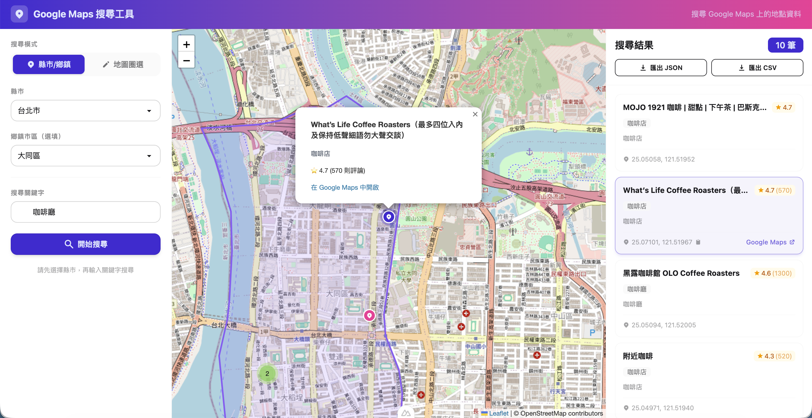

# Google Maps 地點搜尋工具



透過 Puppeteer 自動化爬取 Google Maps 搜尋結果，支援以台灣縣市/鄉鎮或地圖手繪區域作為搜尋範圍，並在地圖上視覺化呈現。

## 功能特色

- 依台灣縣市、鄉鎮區域搜尋 Google Maps 地點
- 在地圖上手繪自訂搜尋範圍
- 大範圍自動網格切割，透過 SSE 即時回傳搜尋進度
- Leaflet 地圖視覺化，支援 marker clustering
- Puppeteer 爬蟲含反偵測、UA 輪換、頻率限制

## Tech Stack

Nuxt 4 · Vue 3 · TypeScript · Tailwind CSS 4 · DaisyUI 5 · Leaflet · Puppeteer

## 快速開始

```bash
npm install
npm run dev
```

開啟 http://localhost:3000

## 指令

| 指令 | 說明 |
|------|------|
| `npm run dev` | 啟動開發伺服器 |
| `npm run build` | 正式環境建置 |
| `npm run preview` | 預覽建置結果 |

## 環境變數

爬蟲參數可透過 `SCRAPER_*` 環境變數調整，詳見 `nuxt.config.ts`。
